# 技能透镜 Skill Lens

**Claude Code Skills 可视化仪表盘** — 扫描、浏览、标签化、编排你的技能库。

> 你可能有 30 个、80 个、甚至 130+ 个 Skills。
> 但你真的知道它们各自在干什么吗？哪些在被用、哪些早已吃灰？
> 它们之间有没有依赖、有没有重复、有没有遗漏？
>
> 技能透镜就是为了回答这些问题而生的。

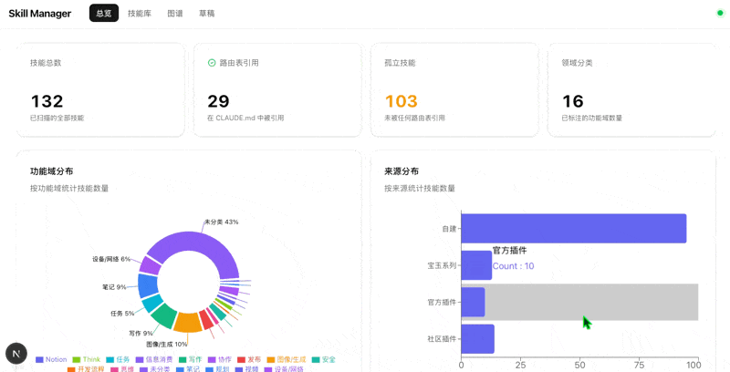

---

## 为什么需要它

使用 Skill 的感觉会越来越熟练。慢慢地你会形成一种意识：**把所有能力都封装成 Skill，放到 AI 里去用** — 自己的经验、别人的最佳实践、学到的方法论，统统封装进去。

但当技能库膨胀到 50 个以上，问题来了：

- **认知失控** — 不记得哪个 Skill 干什么，打标签的比没打的少
- **重复建设** — 新写了一个 Skill，后来发现原来已经有类似的
- **路由断裂** — CLAUDE.md 里引用了 Skill 名，但文件已经改名或删除
- **编排困难** — 想把几个 Skill 组合成工作流，却没有全局视角

技能透镜不是又一个管理工具，它是你的 **Skill 仪表盘** — 像 macOS 的活动监视器一样，让你对整个技能库一目了然。增强你的认知能力，让你真正掌控自己的 AI 能力体系。

---

## 核心原则：只读安全

**技能透镜永远不会修改你的 Skill 文件。**

这是最重要的设计原则。你的 Skills 是你的核心资产，任何工具都不应该在未经许可的情况下碰它们。

```
你的 Skills 文件                    技能透镜
┌──────────────────┐               ┌──────────────────┐
│ ~/.claude/skills/ │──── 只读扫描 ──▶│ 展示、标签、统计   │
│ ~/.claude/plugins/│               │                  │
│ ~/.claude/CLAUDE.md│               │ data/registry.json│ ◀── 所有编辑写到这里
└──────────────────┘               └──────────────────┘
       永远不碰 ✋                       独立数据文件
```

**你可以随时删除整个技能透镜文件夹，你的 Skills 纹丝不动。**

---

## 30 秒安装

```bash
curl -fsSL https://raw.githubusercontent.com/anthropics-skills/skill-lens/main/install.sh | bash
```

脚本会自动：
1. 检查依赖（Node.js 18+、pnpm）
2. 克隆到 `~/.claude/skill-lens/`
3. 安装依赖
4. 创建 macOS Dock 启动器
5. 启动仪表盘并打开浏览器

---

## 功能一览

### 1. 总览仪表盘

一眼看清全局：技能总数、路由状态、领域分布、来源构成、最近修改。


---

### 2. Notion 风格多维表格

这是参照 Notion 多维表格的方式设计的，非常适合用来管理 Skill。

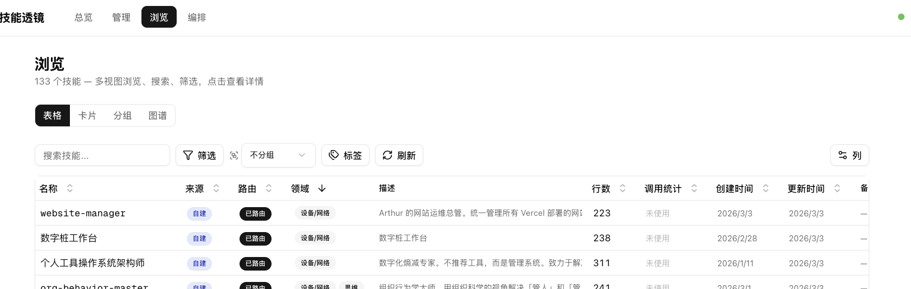

#### 排序 — 按创建时间、修改时间一键排列

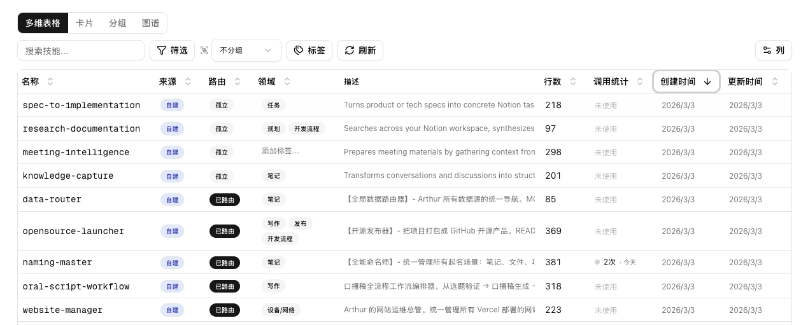

#### 多维分析 — 来源、路由状态、正文行数一目了然

- **自动分析 Skill 来源**：自建 / 宝玉系列 / 官方插件 / 社区插件
- **自动分析 CLAUDE.md 路由状态**：哪些 Skill 在路由表中被引用，哪些是孤立的
- **正文行数统计**：这是一个很实用的功能 — 通过行数可以判断 Skill 是否过度冗余

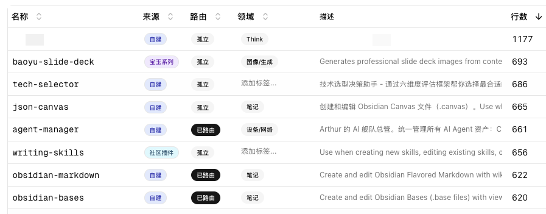

#### 调用频率 — 自动统计一个月内的真实使用情况

自动从 Claude Code 会话日志中统计调用次数和上次调用时间。创建出来的 Skill 到底有没有发挥价值，一看便知。

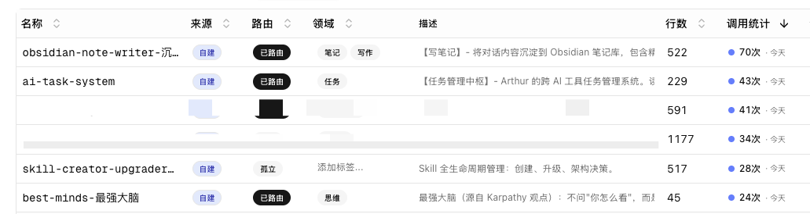

#### 筛选与排序 — Notion 风格条件筛选器

支持多字段组合筛选，列可见性按需显示/隐藏。

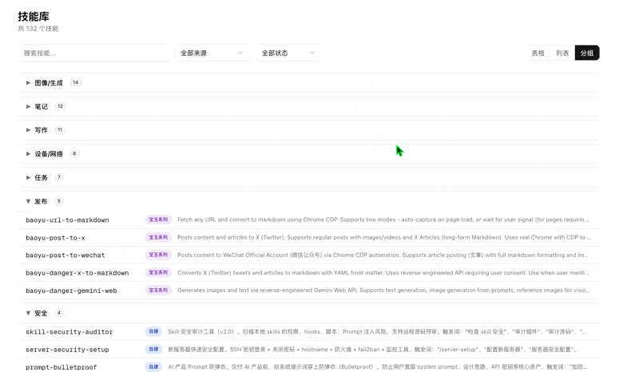

---

### 3. 标签系统

将所有 Skill 通过标签快速整理。同一个标签下的 Skill 被梳理出来后，可以很直观地感受到：哪些是冗余的，哪些是被遗漏的，哪些可以进行流程编排。**掌控力，就是这样来的。**

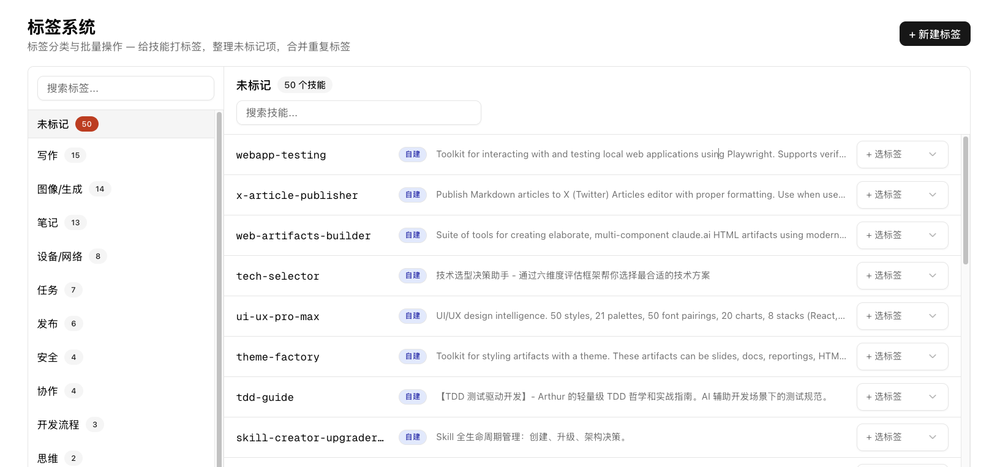

---

### 4. 3D 知识图谱

用 3D 力导向图展示技能关系网络。球体 = 技能，颜色 = 来源，大球 = 领域中心节点，连线 = 共享领域。可以旋转、缩放、搜索高亮、按来源/领域过滤。增加点新鲜感。


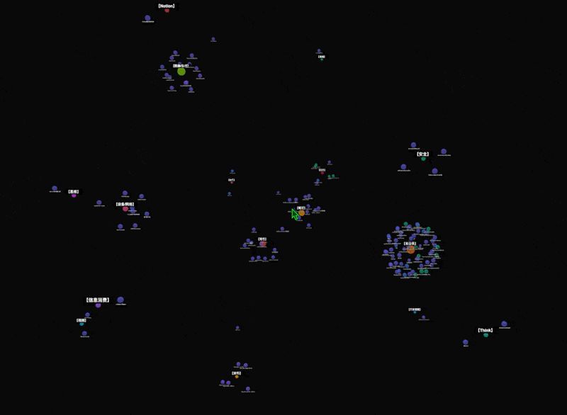

---

### 5. 更多视图

除了表格，还有卡片视图和分组视图，视图偏好自动记住。

**卡片视图**

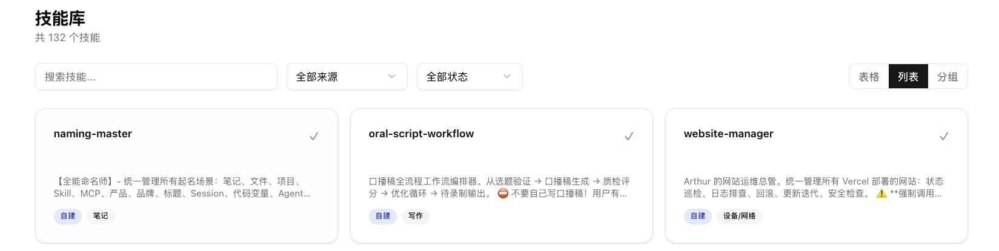

**分组视图** — 按领域折叠展开

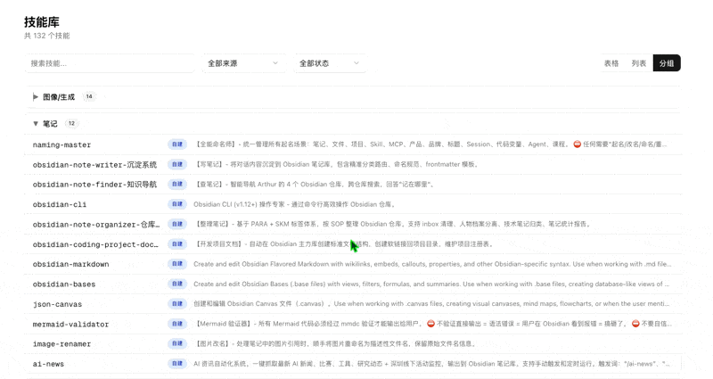

---

### 6. Skill 详情面板

每个 Skill 的 description 经过数据清洗，排版更清晰，方便观看。我们自己能看得懂，AI 才能看得懂。

- CLAUDE.md 路由引用情况
- 领域标签编辑（带自动补全）
- 备注功能（不影响原文件）
- SKILL.md 原文查看

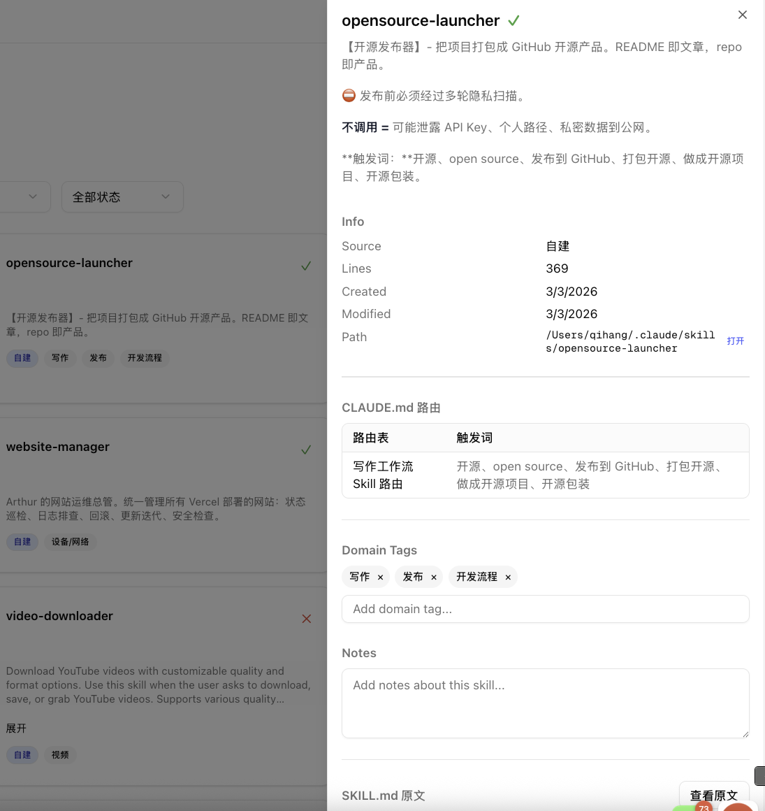

---

### 7. 草稿画布

自由拖拽 Skills 到画布上，连线、分组、编排。适合在规划工作流或重组技能体系时使用。

- 从侧边栏拖拽或点击添加
- 节点间连线（自动箭头）
- 分组节点（可缩放、可重命名）
- 多份草稿保存/切换

---

## AI 智能功能

接入 OpenRouter API（用户配自己的 Key），解锁三个 AI 能力：

### AI 智能打标签

对于几十上百个 Skill，手动打标签是不现实的。AI 可以一键分析所有未标记的 Skill，给出标签建议。


预览每个建议，包含置信度和理由，勾选后批量应用：


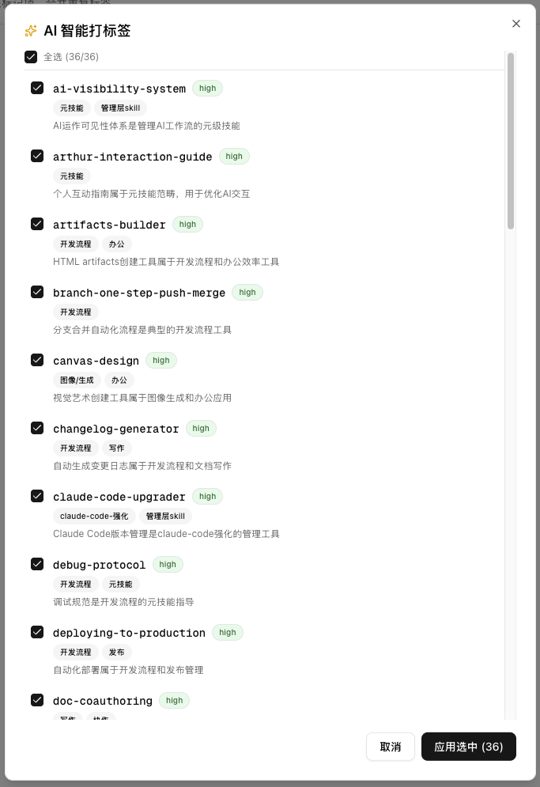

一键打标签的结果 — 同一功能的 Skill 被自动归类到一起：

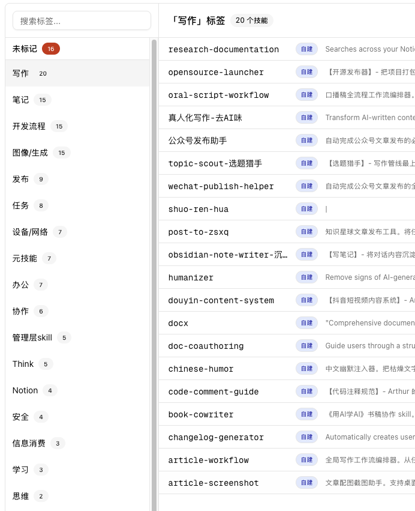

---

### AI 工作流编排

输入你要完成的任务场景，AI 自动从你的技能库中挑选相关 Skill，排布成工作流。这对理解"我现有的 Skill 能怎么组合"很有参考价值。

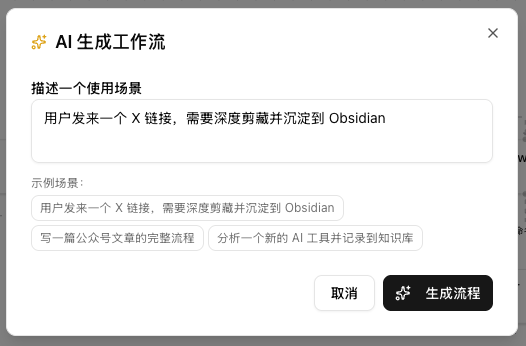

直接把你有的 Skill 排布好了：

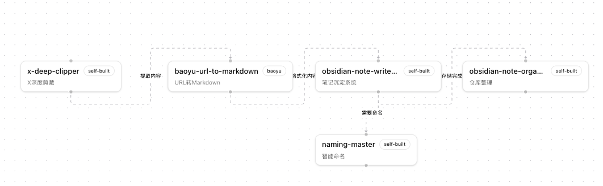

---

### AI 健康度报告

纵览全局，打出健康分报告。从触发力、路由覆盖、标签覆盖、体量异常、功能重叠等多个维度分析你的技能库。


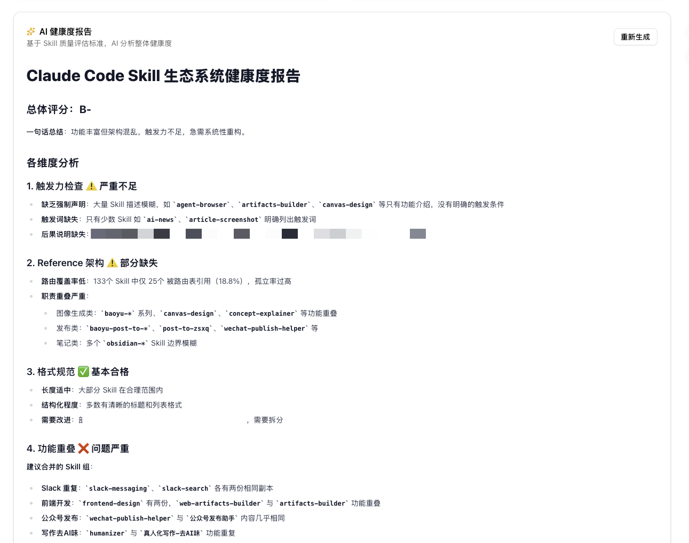

---

## 配置

### 自定义扫描路径

默认扫描 `~/.claude/skills/` 和 `~/.claude/plugins/cache/`。如果你的 Skills 在别的位置：

```bash
SKILL_DIRS=/path/to/skills,/another/path pnpm dev
```

### AI 功能配置

启动后点击右上角齿轮图标，填入你的 [OpenRouter](https://openrouter.ai/) API Key 即可。Key 存储在本地 `data/settings.json`（已被 .gitignore 忽略），永远不会上传。

### 所有环境变量

| 变量 | 默认值 | 说明 |
|------|--------|------|
| `SKILL_DIRS` | `~/.claude/skills` | 技能目录（逗号分隔多个） |
| `PLUGINS_CACHE_DIR` | `~/.claude/plugins/cache` | 插件缓存目录 |
| `CLAUDE_MD_PATH` | `~/.claude/CLAUDE.md` | CLAUDE.md 路径 |
| `PROJECTS_DIR` | `~/.claude/projects` | 会话日志目录（频率统计用） |

---

## 技术栈

| 层 | 选择 |
|---|---|
| 框架 | Next.js 16 (App Router) |
| 语言 | TypeScript (strict) |
| UI | shadcn/ui + Tailwind CSS |
| 表格 | @tanstack/react-table |
| 画布 | @xyflow/react (React Flow) |
| 3D 图谱 | react-force-graph-3d + Three.js |
| 图表 | recharts |
| AI | OpenAI SDK + OpenRouter |
| 文件监控 | chokidar |

---

## 参与共建

技能透镜是一个人启动的项目，但它解决的是所有 Claude Code 重度用户的共性问题。如果你也在管理大量 Skills，欢迎一起来建设。

### 可以贡献什么

- **新视图** — Timeline？依赖树？使用热力图？
- **智能分析** — 自动检测重复 Skill、描述缺失等健康度指标
- **导入/导出** — 导出为 CLAUDE.md 路由表片段
- **多语言** — 目前 UI 是中文，欢迎贡献 i18n

### 开发指南

```bash
git clone https://github.com/anthropics-skills/skill-lens.git
cd skill-lens
pnpm install
pnpm dev       # http://localhost:3000
pnpm build     # 类型检查 + 构建
```

---

## Roadmap

- [ ] Agent Team 项目级 Skill 管理
- [ ] CLAUDE.md 路由表可视化编辑
- [ ] 更多维关系自动梳理
- [ ] 批量操作 — 批量打标签、批量修改领域
- [ ] 插件系统 — 自定义分析维度

---

## License

[MIT](LICENSE)

---

> **技能透镜** — 让你对自己的 AI 能力库，真正做到心中有数。
