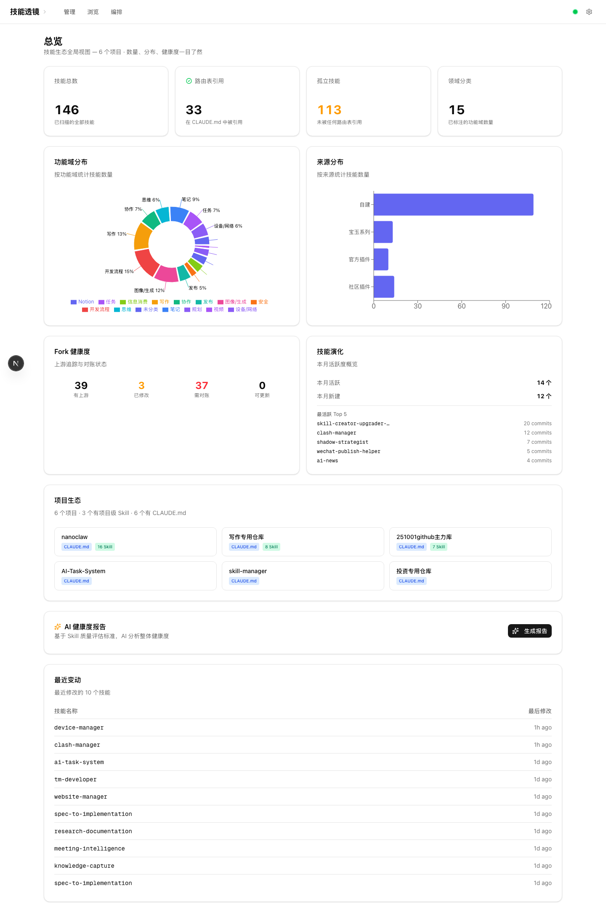
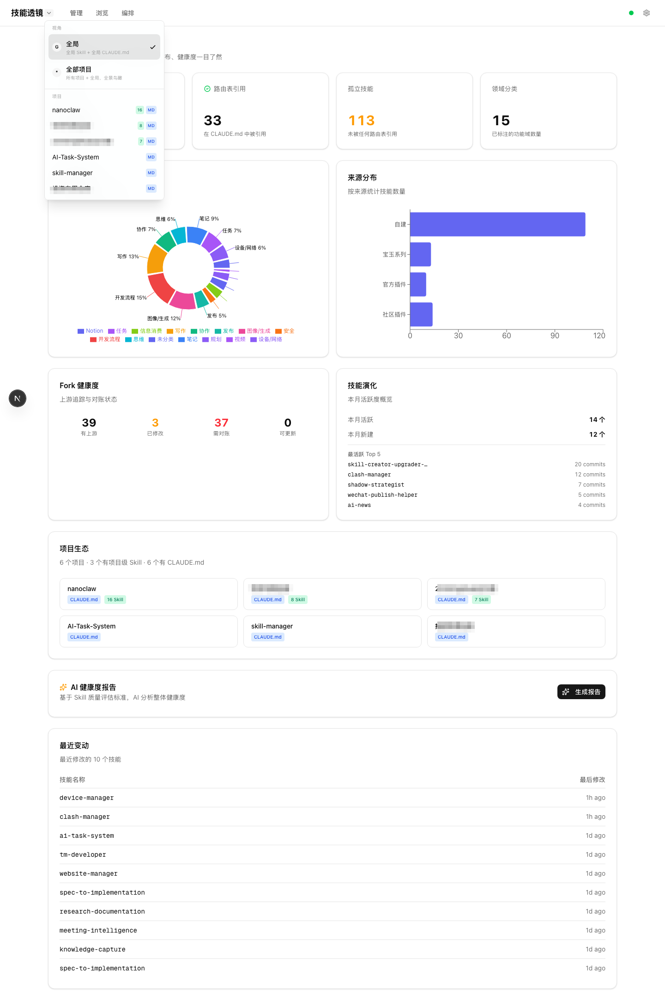
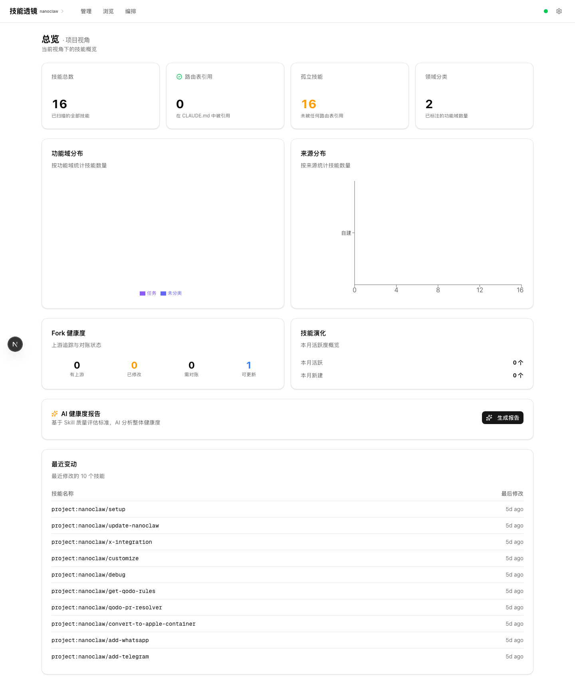
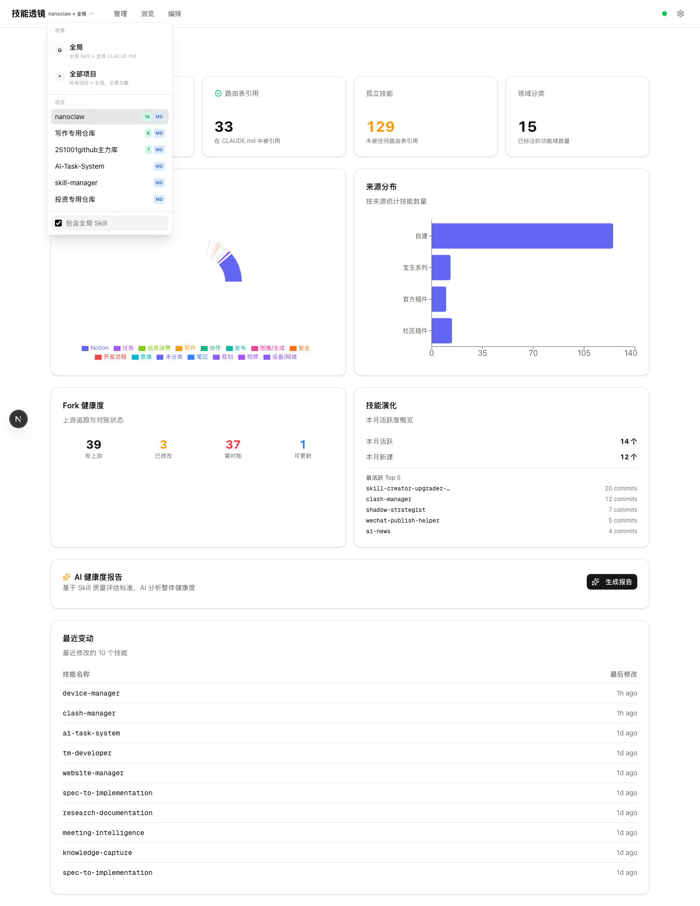
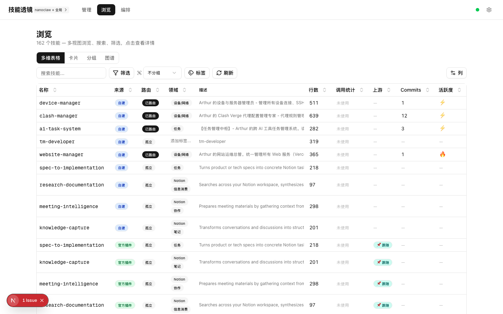
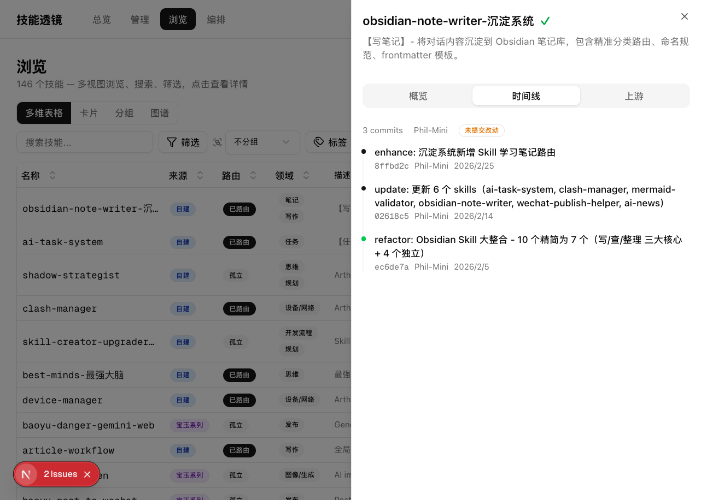
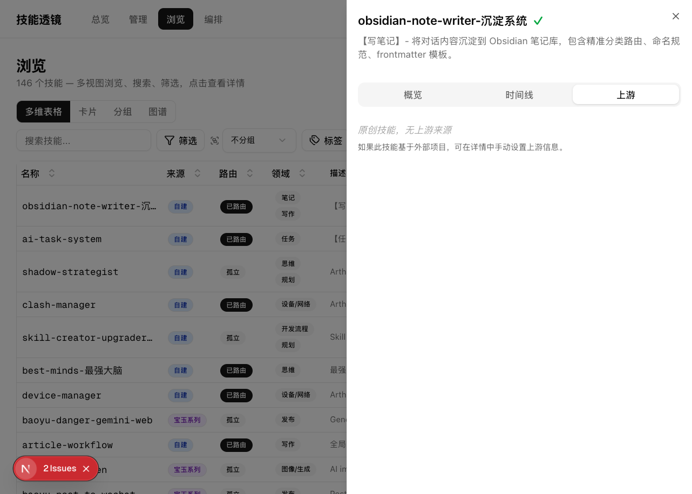
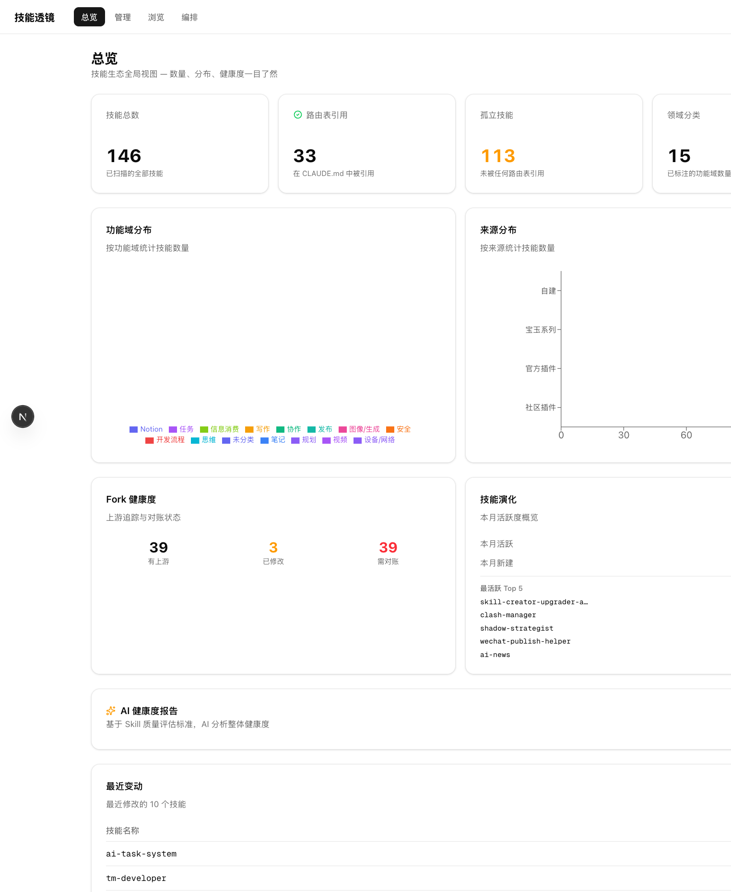
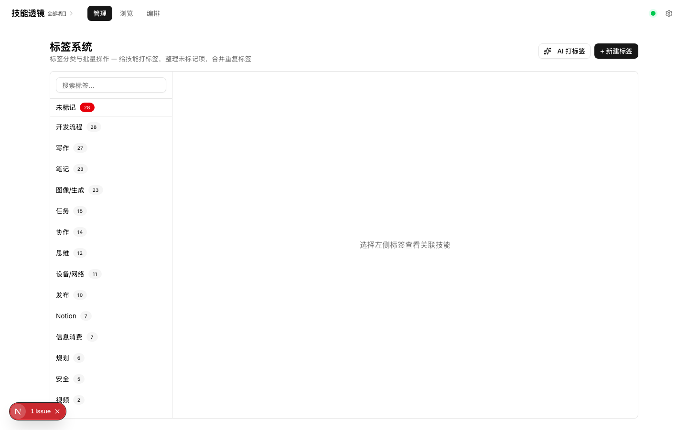

# 技能透镜 Skill Lens `v2.1`

**一个装在你电脑上的 Claude Code 技能管理工具。**

你用 Claude Code 越多，攒下来的 Skill 就越多。10 个的时候还记得住，50 个以上就开始混乱了 — 不记得哪个干什么、不知道哪个在被用、改了 CLAUDE.md 也不记得改了什么。

技能透镜就是解决这个问题的。它跑在你自己的电脑上（`localhost:3000`），自动扫描你所有的 Skill 文件，变成一个看得见、管得了的仪表盘。

**所有数据都在你本地，不上传任何内容。你可以随时删掉整个工具，你的 Skill 文件一个字都不会被改。**



如果这个工具对你有帮助，请给一个 **Star** ⭐ — 你的支持是这个项目继续迭代的最大动力。

---

## 目录

- [它能帮你做什么](#它能帮你做什么)
- [安装（30 秒）](#安装30-秒)
- [核心功能](#核心功能)
  - [总览仪表盘](#1-总览仪表盘)
  - [视角切换 — 全局和项目分开看](#2-视角切换--全局和项目分开看)
  - [技能表格 — 像 Notion 一样管理](#3-技能表格--像-notion-一样管理)
  - [技能禁用/启用 — 太多了就关掉几个](#4-技能禁用启用--太多了就关掉几个)
  - [CLAUDE.md 版本管理](#5-claudemd-版本管理)
  - [技能详情面板](#6-技能详情面板)
  - [社区技能追踪](#7-社区技能追踪)
  - [标签分类系统](#8-标签分类系统)
  - [更多浏览方式](#9-更多浏览方式)
  - [编排区 — 三个视图理解技能关系](#10-编排区--三个视图理解技能关系)
- [AI 智能功能](#ai-智能功能)
  - [AI 自动打标签](#ai-自动打标签)
  - [AI 工作流编排](#ai-工作流编排)
  - [AI 健康度报告](#ai-健康度报告)
- [建议：给你的 .claude 目录做版本管理](#建议给你的-claude-目录做版本管理)
- [工具配置](#工具配置)
- [更新日志](#更新日志)
- [接下来要做的](#接下来要做的)
- [一起来建设](#一起来建设)

---

## 它能帮你做什么

用 Skill 用久了，你会形成一种习惯：**把所有能力都封装成 Skill** — 自己的经验、别人的最佳实践、学到的方法论，统统封装进去，让 AI 随时调用。

这是对的。但当技能库膨胀到 50 个以上，你会遇到这些问题：

| 问题 | 具体表现 |
|------|---------|
| **记不住** | 不记得哪个 Skill 干什么，明明有现成的还在重新写 |
| **分不清** | 全局技能和项目技能混在一起，找起来费劲 |
| **看不到变化** | CLAUDE.md 改了很多次，不记得什么时候改了什么 |
| **不知道谁在用** | 创建了一堆 Skill，不知道哪些真的被调用过 |
| **路由断了** | CLAUDE.md 里引用了某个 Skill，但那个 Skill 早就改名或删了 |
| **版本丢了** | 上周的 CLAUDE.md 效果更好，但已经回不去了 |

技能透镜就是帮你**看清楚**这些问题的工具。它不帮你写 Skill，但它让你对自己的技能库一目了然。

---

## 安装（30 秒）

**前提条件**：你的电脑需要有 [Node.js](https://nodejs.org/)（18 以上版本）和 [pnpm](https://pnpm.io/)。如果没有，先装这两个。

**方式一：一行命令搞定**

```bash
curl -fsSL https://raw.githubusercontent.com/PhilRobinluo/skill-lens/main/install.sh | bash
```

这个脚本会自动帮你：下载代码 → 安装依赖 → 启动服务 → 打开浏览器。

**方式二：手动安装**

```bash
git clone https://github.com/PhilRobinluo/skill-lens.git
cd skill-lens
pnpm install
pnpm dev
```

装好后打开浏览器，访问 `http://localhost:3000` 就能看到你的技能仪表盘了。

---

## 核心功能

### 1. 总览仪表盘

打开就是仪表盘。你的所有技能数据一眼扫完：

- **技能总数** — 你一共有多少个 Skill
- **路由引用** — 多少个被 CLAUDE.md 引用了（被 AI 知道的）
- **孤立技能** — 多少个没有被引用（可能被遗忘了）
- **功能分布** — 饼图展示你的技能按功能分成了哪些类
- **来源分布** — 哪些是自己写的，哪些是社区下载的
- **最近修改** — 最近动过的 Skill 列表


---

### 2. 视角切换 — 全局和项目分开看

这是 v2.0 最重要的新功能。

**背景知识：** 你的 Skill 分两种地方存放：
- **全局技能**：放在 `~/.claude/skills/` 里，所有项目都能用
- **项目级技能**：放在某个项目的 `.claude/skills/` 里，只有那个项目能用

当你同时在做好几个项目时，这些技能会混在一起。技能透镜让你可以**切换视角**，想看哪些就看哪些：

| 视角 | 看到什么 | 什么时候用 |
|------|---------|----------|
| **全局** | 只看通用技能 | 平时管理技能库 |
| **全部项目** | 看所有技能（通用 + 所有项目的） | 盘点全部家当 |
| **某个项目** | 只看这个项目的技能 | 专注做某个项目 |
| **某个项目 + 全局** | 这个项目的技能 + 通用技能 | 项目开发时的完整视角 |

**怎么切换：** 点导航栏左上角的项目名称，就会弹出一个下拉菜单。里面列出了你电脑上所有被 Claude 管理的项目（自动发现的，不需要手动配置）：



切换之后，**整个页面的数据都会变** — 仪表盘的数字、表格的内容、标签的统计，全部联动。

**切换到某个项目的视角**，仪表盘只展示这个项目的技能：



**勾选"包含全局 Skill"**，就能同时看到这个项目的技能和通用技能：



你选的视角会自动记住，下次打开还是这个视角。

---

### 3. 技能表格 — 像 Notion 一样管理

这是你管理技能最常用的界面。设计参照了 Notion 的多维表格，操作方式差不多：


**它能做什么：**

**排序** — 按修改时间、创建时间、行数等字段排序，找到你最近改过的、最长的、最旧的 Skill。


**自动分析** — 不需要你手动标注，表格自动帮你看这些信息：
- **来源**：这个 Skill 是你自己写的，还是从社区下载的？
- **是否被路由**：CLAUDE.md 有没有引用这个 Skill？没引用的话 AI 不知道它的存在
- **行数**：Skill 写了多少行，太长的可能需要精简


**调用频率** — 自动统计每个 Skill 在最近一个月内被 Claude 调用了多少次。创建了但从来没被用过的 Skill，一看就知道。


**筛选** — 和 Notion 一样，可以加条件筛选。比如"只看自建的、没有被路由的 Skill"，找出那些你写了但 AI 不知道的技能。


**社区技能追踪列** — 如果你的 Skill 是从社区下载后修改的，表格会直接显示它的来源和你改了多少次。

*(截图待更新)*

**视角联动** — 切换视角后表格内容自动变化，不用手动筛选。



---

### 4. 技能禁用/启用 — 太多了就关掉几个

**v2.1 新增功能。**

Skill 数量超过 50 个以后，Claude Code 每次会话都要加载所有 Skill 的描述信息。这会占用宝贵的上下文窗口，还可能让 AI "选择困难"。

技能透镜让你可以**一键禁用**不常用的 Skill，让 Claude Code 不再加载它们：

**怎么用：**

1. 打开技能表格（`/skills`），每一行左边有一个**开关**
2. 关掉开关 = 禁用这个 Skill
3. 禁用后的 Skill：行变灰、名称加删除线，一眼就能分辨

**背后发生了什么：**

禁用时，工具会把 `SKILL.md` 重命名为 `SKILL.md.disabled`。Claude Code 扫描时找不到 `SKILL.md`，就不会加载这个 Skill。

启用时，改回 `SKILL.md` 就行。**你的 Skill 内容不会被修改或删除**，只是文件名变了。

**哪里能看到禁用状态：**

| 位置 | 显示什么 |
|------|---------|
| **技能表格** | 每行左边的开关，禁用的行变灰 |
| **技能详情面板** | 顶部有启用/禁用开关 |
| **仪表盘** | "已禁用"统计卡片，显示你关掉了多少个 |

**适用范围：** 自己写的 Skill、社区下载的 Skill、插件带的 Skill 都能禁用。

---

### 5. CLAUDE.md 版本管理

CLAUDE.md 是 Claude Code 最重要的配置文件。它告诉 AI："遇到什么情况，调用什么 Skill"。

**为什么要管理它的版本？**

Anthropic（Claude 的开发公司）的官方建议是：CLAUDE.md 是一个需要**反复优化**的文档。你用 Claude 越久，就会越频繁地修改它 — 加新的路由规则、删掉过时的配置、调整触发词。

但问题来了：如果你改了一版发现效果不好，想回到之前那版 — 你还记得之前写的是什么吗？

技能透镜帮你解决这个问题。它读取你的 Git 提交记录（后面会教你怎么设置），把 CLAUDE.md 的每一次修改都可视化出来：

**你能看到的信息：**

| 功能 | 解决什么问题 |
|------|------------|
| **版本历史** | 看到 CLAUDE.md 的每一次修改记录，点击就能看那个版本的完整内容 |
| **逐行溯源** | 每一行旁边标注了"这行是什么时候、被谁改的"，定位问题很方便 |
| **修改对比** | 展开任意一次修改，绿色是新加的、红色是删掉的，一目了然 |
| **未保存提醒** | 如果你改了 CLAUDE.md 但还没提交到 Git，会有醒目提示 |

*(截图待更新)*

**多个项目的 CLAUDE.md 放在一起看** — 切换到"全部项目"视角时，左边会列出你所有的 CLAUDE.md 文件，点击就能切换：

*(截图待更新)*

**查看某个项目的 CLAUDE.md：**

*(截图待更新)*

---

### 6. 技能详情面板

点击表格里任何一个 Skill，右边会弹出详情面板。这里能看到一个 Skill 的所有信息，分成四个标签页：

*(截图待更新)*

**总览** — Skill 的描述、它在 CLAUDE.md 中的引用情况、标签编辑、备注

*(截图待更新)*

**时间线** — 这个 Skill 文件的修改历史。每次修改都能展开看具体改了什么。



**上游** — 如果这个 Skill 是从社区下载后修改的，这里显示它的原始来源、你改了多少、原版长什么样。



---

### 7. 社区技能追踪

很多人会从社区下载别人写好的 Skill，然后根据自己的需要修改。时间一长，你改过的版本和原版会越来越不同。

技能透镜自动检测这些关系，在仪表盘展示整体情况：

- **有来源的技能** — 多少个是从社区下载的
- **已修改** — 其中多少个你做了修改
- **需要对比** — 多少个可能需要和原版对比看看
- **可以更新** — 原版有新版本，你可以考虑同步



---

### 8. 标签分类系统

给技能打标签，然后按标签分类查看。同一类功能的 Skill 放在一起看，你就能发现：这几个好像是重复的、那个功能好像缺了一个。

标签也支持视角切换 — 全局技能有全局的标签统计，项目技能有项目的标签统计。


切换到不同视角，标签的数字会跟着变：




---

### 9. 更多浏览方式

除了表格，还有两种看 Skill 的方式：

**卡片视图** — 每个 Skill 一张卡片，信息密度比表格低，浏览起来更轻松


**分组视图** — 按功能域折叠展开，快速找到某类技能

*(截图待更新)*

**3D 图谱** — 用 3D 球体展示技能关系，换个角度看你的技能库。球体是技能，连线是共享的功能域，颜色代表来源。


---

### 10. 编排区 — 三个视图理解技能关系

导航栏的"编排"入口下有三个标签页，帮你理解技能之间的关系：

| 标签页 | 做什么 | 怎么用 |
|--------|--------|--------|
| **CLAUDE.md** | 查看和管理你的 CLAUDE.md 配置文件 | 版本历史、逐行溯源、修改对比、多文件切换 |
| **调用关系** | 展示哪些 Skill 被 CLAUDE.md 引用了、哪些之间有依赖、哪些是孤立的 | 一眼看出路由覆盖率和孤立技能 |
| **草稿画布** | 自由拖拽 Skill 到画布上，手动连线、分组、编排 | 规划工作流、重组技能体系 |

**调用关系**帮你回答一个关键问题：你的 CLAUDE.md 路由了多少个 Skill？有多少个 Skill 虽然存在但 AI 根本不知道？

**草稿画布**是给你自由发挥的地方：
- 从左边拖 Skill 到画布上
- 用连线表示调用关系
- 用分组框把相关的 Skill 圈在一起
- 多份草稿可以保存和切换

---

## AI 智能功能

以下功能需要接入 AI（配一个 [OpenRouter](https://openrouter.ai/) 的 Key，在设置页面填入即可）。

### AI 自动打标签

技能多了之后手动一个个打标签不现实。AI 可以一键分析所有没有标签的 Skill，告诉你它觉得每个应该属于什么类别：


每个建议都会显示理由和置信度，你可以挑选后一键应用：


应用之后的效果 — 同类 Skill 自动归到一起了：


---

### AI 工作流编排

告诉 AI 你想做什么事，它会从你的技能库里挑出相关的 Skill，帮你排成一个工作流。


---

### AI 健康度报告

让 AI 整体评估你的技能库健康程度：路由覆盖率够不够、有没有功能重叠、哪些 Skill 写得太长需要精简。


---

## 建议：给你的 .claude 目录做版本管理

技能透镜的版本追踪功能（CLAUDE.md 的修改历史、逐行溯源、修改对比）依赖 Git。如果你的 `~/.claude/` 目录还没有用 Git 管理，强烈建议你现在就设置一下。

**为什么值得做？**

你的 `~/.claude/` 目录里存着两样重要的东西：
1. **CLAUDE.md** — AI 的行为配置，改一个字都可能影响效果
2. **skills/** — 你积累的所有技能，是你的核心资产

这些内容和代码一样，值得被版本管理。改坏了能回退，改好了知道好在哪。

**怎么做（3 分钟搞定）：**

```bash
# 进入你的 .claude 目录
cd ~/.claude

# 初始化 Git 仓库
git init

# 把现有文件都加进去
git add CLAUDE.md skills/

# 做第一次提交
git commit -m "初始版本"
```

以后每次修改了 CLAUDE.md 或者 Skill 文件，记得提交一下：

```bash
cd ~/.claude
git add -A
git commit -m "说明改了什么"
```

**提交时注意：** 检查一下你的 CLAUDE.md 里有没有敏感信息（比如 API Key、密码、私人数据）。如果有的话，要么用环境变量代替，要么把它加到 `.gitignore` 里。

做了 Git 管理之后，技能透镜的版本追踪功能就能完整使用了 — 你能看到每次修改的历史、每一行的来源、任何版本的完整内容。

---

## 工具配置

### 扫描路径

技能透镜默认扫描这两个目录：
- `~/.claude/skills/` — 你的全局技能
- `~/.claude/plugins/cache/` — 安装的插件

如果你的 Skill 放在其他地方，可以通过环境变量指定：

```bash
SKILL_DIRS=/你的路径1,/你的路径2 pnpm dev
```

### AI 功能

启动后点右上角的齿轮图标，填入你的 [OpenRouter](https://openrouter.ai/) API Key。这个 Key 只存在你本地的 `data/settings.json` 文件里，不会上传到任何地方。

### 安全说明

技能透镜**不会修改你的 Skill 内容**。标签、备注等编辑保存在工具自己的 `data/registry.json` 文件里。

唯一例外：**禁用功能**会把 `SKILL.md` 重命名为 `SKILL.md.disabled`（启用时改回来）。文件内容不变，只是名字变了。

你可以随时删掉整个 skill-lens 文件夹，你的 Skill 文件不会少一个字（已禁用的手动改回文件名即可）。

---

## 更新日志

### v2.1（2026-03-17）— 技能禁用/启用

- **技能禁用/启用** — 一键开关，禁用后 Claude Code 不再加载该 Skill
- **表格 Switch 列** — 每个 Skill 旁边有开关，点击即生效
- **详情面板开关** — 技能详情里也可以切换启用状态
- **仪表盘统计** — 新增"已禁用"统计卡片
- **CLAUDE.md 版本标记** — 给 Git 历史中的版本打标签（正式版/实验版），一键恢复到任意版本

### v2.0（2026-03-09）— 视角切换 + 版本管理

- **视角系统** — 全局 / 全部项目 / 单个项目 / 混合，四种视角自由切换
- **自动发现项目** — 自动扫描你电脑上所有被 Claude 管理的项目
- **CLAUDE.md 版本管理** — 修改历史、逐行溯源、修改对比
- **多个 CLAUDE.md 一起看** — 全局的和各项目的 CLAUDE.md 放在同一个界面里切换
- **未保存提醒** — CLAUDE.md 改了但没提交，会有醒目提示
- **全页面联动** — 切换视角后所有页面的数据都跟着变

### v1.5 — 社区技能追踪

- 自动检测哪些 Skill 是从社区下载的
- 追踪你的修改和原版的差异
- 技能修改时间线
- 文件浏览器

### v1.0 — 基础版本

- 技能扫描和展示
- 多维表格、卡片、分组视图
- CLAUDE.md 路由检测
- 调用频率统计
- 标签系统
- AI 打标签、工作流编排、健康度报告
- 3D 知识图谱
- 草稿画布

---

## 接下来要做的

- [ ] 英文版本 — 国际化支持
- [ ] 性能优化 — 大量 Skill 时的加载速度
- [ ] 批量禁用/启用 — 一次操作多个 Skill
- [ ] 批量打标签
- [ ] 编排画布与 CLAUDE.md 联动
- [ ] 更多 AI 分析能力

---

## 一起来建设

这个工具是一个人做出来的，但它解决的是所有 Claude Code 深度用户的共性问题。如果你也在管理一堆 Skills，欢迎参与：

- **提需求**：[Issue](https://github.com/PhilRobinluo/skill-lens/issues) 里说说你想要什么功能
- **提 Bug**：遇到问题也欢迎反馈
- **贡献代码**：Fork 后提 PR

**本地开发：**

```bash
git clone https://github.com/PhilRobinluo/skill-lens.git
cd skill-lens
pnpm install
pnpm dev       # 启动开发服务器 http://localhost:3000
pnpm build     # 构建检查
pnpm test      # 运行测试
```

**技术栈**：Next.js 16 + TypeScript + shadcn/ui + Tailwind CSS + TanStack Table + React Flow + recharts

---

[MIT License](LICENSE) — 免费使用，随便改。

---

> **技能透镜** — 让你对自己的 AI 能力库，真正做到心中有数。
