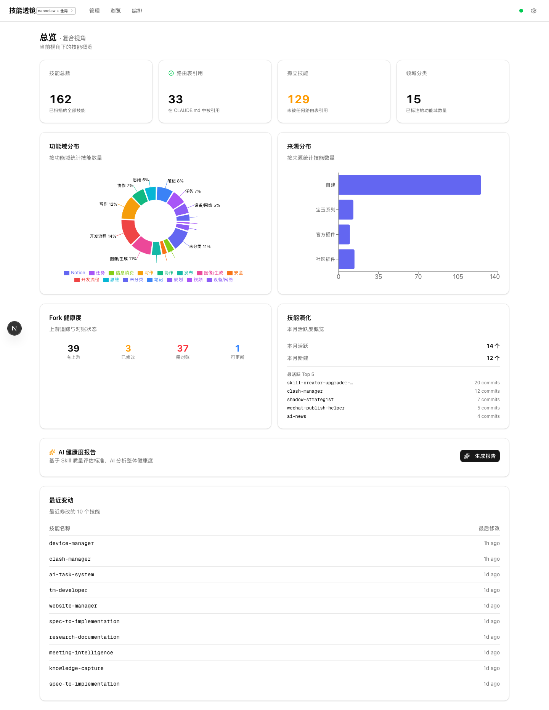
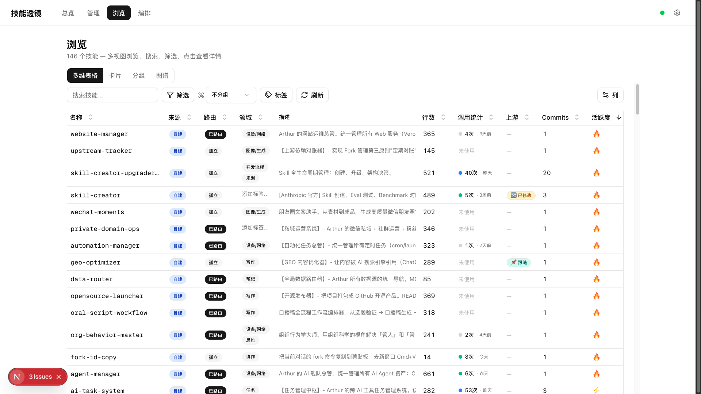
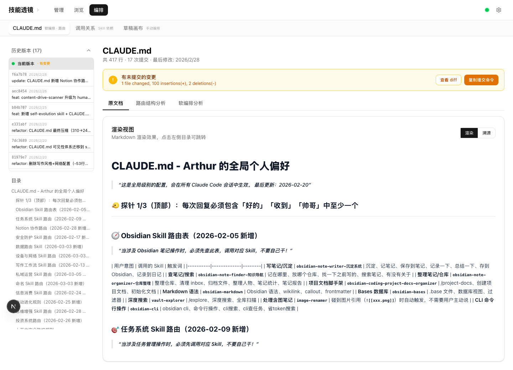
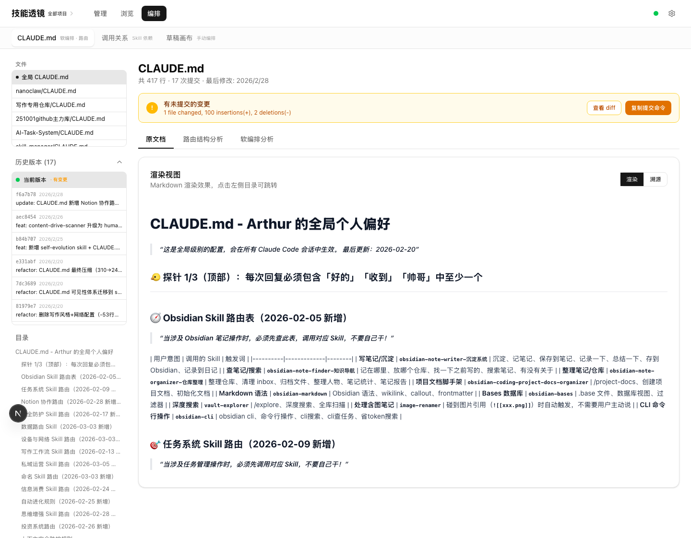
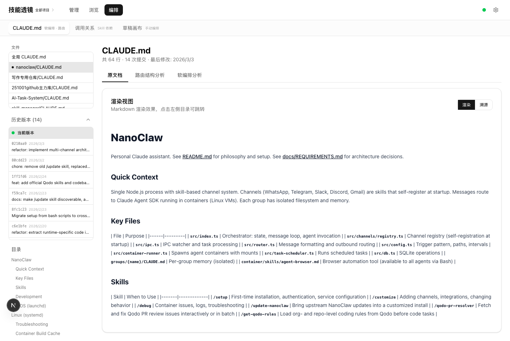
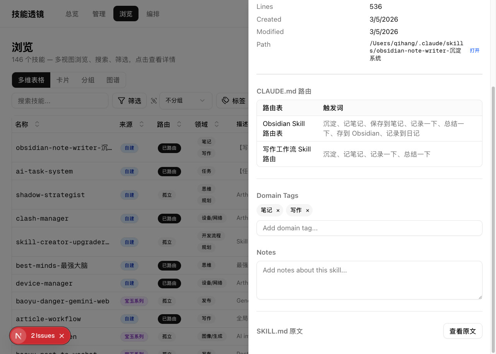

# 技能透镜 Skill Lens `v2.0`

> **v2.0 新增：** Scope 系统（全局/项目级 Skill 管理）、CLAUDE.md 版本管理（历史/Blame/Diff）、Fork 健康度追踪、项目级 CLAUDE.md 多文件浏览

**一个安装在本地的 Claude Code Skills 管理系统。**

技能透镜是一个**本地 Web 应用**，专门用来管理你电脑上的 Claude Code Skills。它运行在 `localhost:3000`，扫描你本地的 Skill 文件和项目级 Skill，把散落在文件夹里的几十上百个 `.md` 文件变成一个可视化的仪表盘。

**所有数据都在你本地，不上传任何内容，不联网也能使用核心功能。**

```
你的本地电脑
┌────────────────────────────────────────────────────────────┐
│                                                            │
│  ~/.claude/skills/           技能透镜 (localhost:3000)      │
│  ~/.claude/plugins/    ───▶  扫描、展示、标签、统计、编排     │
│  ~/.claude/CLAUDE.md         版本追踪、Scope 过滤、AI 分析  │
│  ~/projects/*/CLAUDE.md      ↓                             │
│  ~/projects/*/.claude/       data/registry.json             │
│                              (只有这个文件会被写入)           │
│                                                            │
└────────────────────────────────────────────────────────────┘
      你的 Skill 文件永远不会被修改 ✋
```

| 特性 | 说明 |
|------|------|
| **本地运行** | 数据不离开你的电脑，`pnpm dev` 启动即用 |
| **只读安全** | 永远不修改你的 Skill 文件，所有编辑写到独立的 registry.json |
| **自动扫描** | 启动时自动扫描全局 Skills 和项目级 Skills，文件变动实时更新 |
| **Scope 过滤** | 全局、全部项目、单项目、混合视角 — 四种 Scope 自由切换 |
| **版本追踪** | 基于 Git 的 CLAUDE.md 版本历史、逐行溯源、未提交变更检测 |
| **多视图浏览** | Notion 风格表格、卡片、分组、3D 图谱，四种视图随意切换 |
| **标签系统** | 手动打标签 + AI 智能推荐，按功能域分类管理 |
| **调用频率** | 自动统计每个 Skill 的真实调用次数，识别吃灰技能 |
| **路由检测** | 自动分析 CLAUDE.md，标记哪些 Skill 已路由、哪些孤立 |
| **上游追踪** | 自动检测 Fork 来源、变更日志、版本偏移 |
| **AI 辅助** | 健康度报告、智能打标签、工作流编排（需配 OpenRouter Key） |

**你可以随时删除整个技能透镜文件夹，你的 Skills 纹丝不动。**

如果这个工具对你有帮助，请给一个 Star 来鼓励我持续升级和维护。你的 Star 是这个项目继续迭代的最大动力。

---

**Claude Code Skills 可视化管理系统** — 扫描、浏览、标签化、版本追踪、编排你的技能库。

> 你可能有 30 个、80 个、甚至 130+ 个 Skills。
> 但你真的知道它们各自在干什么吗？哪些在被用、哪些早已吃灰？
> 它们之间有没有依赖、有没有重复、有没有遗漏？
> 你的 CLAUDE.md 路由表改了多少次？每一次改动是谁在什么时候做的？
>
> 技能透镜就是为了回答这些问题而生的。


---

## 为什么需要它

使用 Skill 的感觉会越来越熟练。慢慢地你会形成一种意识：**把所有能力都封装成 Skill，放到 AI 里去用** — 自己的经验、别人的最佳实践、学到的方法论，统统封装进去。

但当技能库膨胀到 50 个以上，问题来了：

- **认知失控** — 不记得哪个 Skill 干什么，打标签的比没打的少
- **重复建设** — 新写了一个 Skill，后来发现原来已经有类似的
- **路由断裂** — CLAUDE.md 里引用了 Skill 名，但文件已经改名或删除
- **编排困难** — 想把几个 Skill 组合成工作流，却没有全局视角
- **版本混乱** — 不记得什么时候改了什么，回不去之前的状态
- **项目隔离** — 全局 Skill 和项目级 Skill 混在一起，分不清楚

技能透镜不是又一个管理工具，它是你的 **Skill 管理系统** — 像 macOS 的活动监视器一样，让你对整个技能库一目了然。增强你的认知能力，让你真正掌控自己的 AI 能力体系。

---

## 设计哲学

技能透镜的设计遵循三个核心原则：

### 原则一：只读安全

**技能透镜永远不会修改你的 Skill 文件。**

这是最重要的设计原则。你的 Skills 是你的核心资产，任何工具都不应该在未经许可的情况下碰它们。

```
你的 Skills 文件                    技能透镜
┌──────────────────┐               ┌──────────────────┐
│ ~/.claude/skills/ │──── 只读扫描 ──▶│ 展示、标签、统计   │
│ ~/.claude/plugins/│               │                  │
│ ~/.claude/CLAUDE.md│               │ data/registry.json│ ◀── 所有编辑写到这里
└──────────────────┘               └──────────────────┘
       永远不碰 ✋                       独立数据文件
```

**你可以随时删除整个技能透镜文件夹，你的 Skills 纹丝不动。**

### 原则二：Scope 即数据字段

Scope（视角）不是一个复杂的 UI 概念，它本质上就是数据表格多了一个字段 — `belongsTo`。每个 Skill 要么属于全局（`global`），要么属于某个项目（`/path/to/project`）。所谓 "切换视角"，就是在这个字段上做过滤。

这种设计让 Scope 的实现非常干净：一个 `filterByScope()` 函数贯穿所有 API，前端只需要传一个 `?scope=` 参数，所有页面自动响应。

### 原则三：Git 即版本系统

技能透镜不自建版本系统。你的 CLAUDE.md 和 Skills 文件本身就在 Git 仓库里，技能透镜直接读取 Git 历史，把 commit 记录、blame 信息、diff 内容呈现出来。

不重复造轮子，不引入额外存储，利用你已有的基础设施。

---

## 30 秒安装

**方法一：一键安装**

```bash
curl -fsSL https://raw.githubusercontent.com/PhilRobinluo/skill-lens/main/install.sh | bash
```

脚本会自动：
1. 检查依赖（Node.js 18+、pnpm）
2. 克隆到 `~/.claude/skill-lens/`
3. 安装依赖
4. 创建 macOS Dock 启动器
5. 启动仪表盘并打开浏览器

**方法二：手动安装**

```bash
git clone https://github.com/PhilRobinluo/skill-lens.git
cd skill-lens
pnpm install
pnpm dev
```

浏览器打开 `http://localhost:3000` 即可使用。

---

## 功能详解

### 1. 总览仪表盘

一眼看清全局：技能总数、路由状态、领域分布、来源构成、Fork 健康度、技能演化、项目生态、最近修改。


仪表盘会根据当前 Scope 动态切换数据 — 全局视角展示 146 个技能，切换到"全部项目"则展示 177 个，切换到单个项目只展示该项目的技能。所有统计数据实时联动。


**全部项目视角** — 切换到"全部项目"，一次看到所有技能（全局 + 项目级 = 177 个）：


**项目视角** — 切换到 nanoclaw 项目，仪表盘只展示该项目的 16 个技能：


**复合视角** — 勾选"包含全局 Skill"，同时展示项目技能和全局技能（16 + 146 = 162 个）：



---

### 2. Scope 系统 — 全局与项目级 Skill 管理

这是技能透镜的核心特性之一。当你的 Skills 不只是全局的 `~/.claude/skills/`，还散落在各个项目的 `.claude/skills/` 目录下时，你需要一种方式来区分和管理它们。

**四种 Scope 模式：**

| 模式 | 含义 | 适用场景 |
|------|------|---------|
| **全局** | 只看 `~/.claude/skills/` 下的技能 | 管理通用技能库 |
| **全部项目** | 看所有技能（全局 + 所有项目） | 了解整体技能资产 |
| **单项目** | 只看某个项目的 `.claude/skills/` | 聚焦项目开发 |
| **项目 + 全局** | 某个项目的技能 + 全局技能 | 项目开发时的完整视角 |

**Scope 选择器** — 点击导航栏的项目名称，打开 Scope 下拉菜单。每个项目旁边会标注它有多少个 Skill 和是否有 CLAUDE.md：


勾选底部的"包含全局 Skill"复选框，进入混合视角模式：


**项目发现机制：** 技能透镜会自动扫描你的工作目录，发现所有包含 `CLAUDE.md` 的项目。有 CLAUDE.md = Claude 管理的项目 = 值得追踪的项目。

**Scope 持久化：** 你选择的 Scope 会保存在 `localStorage` 中，下次打开时自动恢复。

---

### 3. Notion 风格多维表格

参照 Notion 多维表格的方式设计，非常适合用来管理 Skill。


#### 排序 — 按创建时间、修改时间一键排列


#### 多维分析 — 来源、路由状态、正文行数一目了然

- **自动分析 Skill 来源**：自建 / 宝玉系列 / 官方插件 / 社区插件
- **自动分析 CLAUDE.md 路由状态**：哪些 Skill 在路由表中被引用，哪些是孤立的
- **正文行数统计**：通过行数可以判断 Skill 是否过度冗余


#### 调用频率 — 自动统计一个月内的真实使用情况

自动从 Claude Code 会话日志中统计调用次数和上次调用时间。创建出来的 Skill 到底有没有发挥价值，一看便知。


#### 筛选与排序 — Notion 风格条件筛选器

支持多字段组合筛选，列可见性按需显示/隐藏。


#### 上游追踪列 — Fork 来源与版本偏移

表格内置"上游"和"Commits"列，直接看到每个 Skill 是否有上游来源、是否已偏离原始版本、有多少本地 commit。



#### Scope 联动 — 表格数据随视角变化

切换 Scope 后，表格内容自动过滤。全局视角看全局 Skill，项目视角只看项目 Skill，不用手动筛选。


---

### 4. CLAUDE.md 版本管理

CLAUDE.md 是 Claude Code 的核心配置文件 — 它定义了 AI 的行为、路由表、触发规则。

**为什么要对 CLAUDE.md 做版本管理？** 从 Anthropic 官方的最佳实践来看，CLAUDE.md 是一个值得反复推倒重来、持续优化的文档。你会不断调整路由规则、添加新的触发词、删除过时的配置。这些改动积累下来，你会想知道：上周那版路由表为什么效果更好？那个被删掉的触发规则到底是什么内容？

这就是为什么技能透镜要为 CLAUDE.md 提供完整的版本管理能力：

**版本历史** — 基于 Git commit 记录，展示 CLAUDE.md 的完整变更时间线。每个版本显示提交时间、作者、变更行数。点击任意版本可以回看当时的完整内容 — 再也不怕改坏了回不去。

**逐行溯源（Blame）** — 每一行内容都标注了最后修改的 commit、作者和时间。当你想知道"这段路由是什么时候加的"、"这个触发词是谁写的"，Blame 视图一目了然。

**Diff 查看器** — 展开任意 commit，查看具体的增删内容。绿色 = 新增行，红色 = 删除行。两个版本之间到底改了什么，不用脑子记，看 Diff 就行。

**未提交变更检测** — 如果 CLAUDE.md 有未 commit 的修改，仪表盘会醒目提示。改了一半忘了提交？这里帮你盯着。



**多文件浏览** — 当 Scope 设置为"全部项目"时，左侧边栏会列出所有可用的 CLAUDE.md 文件（全局 + 各项目），点击即可切换查看。



**项目级 CLAUDE.md** — 切换到 nanoclaw 项目的 CLAUDE.md，查看该项目的独立配置：



---

### 5. Skill 详情面板

点击表格任意一行，右侧弹出详情面板。每个 Skill 的 description 经过数据清洗，排版更清晰，方便观看。我们自己能看得懂，AI 才能看得懂。

四个 Tab 涵盖 Skill 的全部信息：


**总览 Tab** — 描述信息、CLAUDE.md 路由引用、领域标签编辑（带自动补全）、备注功能（不影响原文件）



**时间线 Tab** — 基于 Git 历史的 Skill 文件变更记录。每个 commit 可展开查看 diff 详情。


**上游 Tab** — 如果该 Skill 是从社区 Fork 来的，这里展示上游来源信息、版本偏移程度、原始 vs 当前的变更日志。


---

### 6. Fork 健康度追踪

当你使用社区 Skills 或官方插件时，经常会 Fork 一份到本地修改。时间一长，你的本地版本和上游版本会逐渐分叉。

技能透镜自动检测所有 Fork 关系，并在仪表盘展示整体的 Fork 健康状况：

- **有上游的 Skill 数量** — 多少个 Skill 是 Fork 来的
- **已修改数量** — 其中多少个你做了本地修改
- **需对账数量** — 多少个可能需要和上游同步
- **可更新数量** — 多少个上游有新版本可以更新


---

### 7. 标签系统

将所有 Skill 通过标签快速整理。同一个标签下的 Skill 被梳理出来后，可以很直观地感受到：哪些是冗余的，哪些是被遗漏的，哪些可以进行流程编排。

标签页同样支持 Scope 过滤 — 全局技能有全局的标签分布，项目技能有项目的标签分布。**掌控力，就是这样来的。**


**项目视角下的标签** — 切换到 nanoclaw + 全局的混合视角，标签计数反映当前 scope 下的技能：


**全部项目视角** — 切换到"全部项目"，标签计数会包含所有项目的技能：


---

### 8. 更多视图

除了表格，还有卡片视图和分组视图，视图偏好自动记住。

**卡片视图**


**分组视图** — 按领域折叠展开


---

### 9. 3D 知识图谱

用 3D 力导向图展示技能关系网络。球体 = 技能，颜色 = 来源，大球 = 领域中心节点，连线 = 共享领域。可以旋转、缩放、搜索高亮、按来源/领域过滤。换个角度看你的技能库。


---

### 10. 草稿画布

自由拖拽 Skills 到画布上，连线、分组、编排。适合在规划工作流或重组技能体系时使用。

- 从侧边栏拖拽或点击添加
- 节点间连线（自动箭头）
- 分组节点（可缩放、可重命名）
- 多份草稿保存/切换

---

## AI 智能功能

接入 OpenRouter API（用户配自己的 Key），解锁三个 AI 能力：

### AI 智能打标签

对于几十上百个 Skill，手动打标签是不现实的。AI 可以一键分析所有未标记的 Skill，给出标签建议。


预览每个建议，包含置信度和理由，勾选后批量应用：


一键打标签的结果 — 同一功能的 Skill 被自动归类到一起：


---

### AI 工作流编排

输入你要完成的任务场景，AI 自动从你的技能库中挑选相关 Skill，排布成工作流。这对理解"我现有的 Skill 能怎么组合"很有参考价值。


直接把你有的 Skill 排布好了：


---

### AI 健康度报告

纵览全局，打出健康分报告。从触发力、路由覆盖、标签覆盖、体量异常、功能重叠等多个维度分析你的技能库。


---

## 数据架构

```
技能透镜数据流
┌─────────────────────────────────────────────────────────────────┐
│                                                                 │
│  数据源                    扫描层                  展示层          │
│                                                                 │
│  ~/.claude/skills/    ──┐                                       │
│  ~/.claude/plugins/   ──┤  scanAll()       ┌──▶ 仪表盘           │
│  ~/.claude/CLAUDE.md  ──┤  ──▶ registry ───┤──▶ 技能表格          │
│  ~/projects/*/        ──┤  + belongsTo     ├──▶ 标签系统          │
│    .claude/skills/    ──┤  + upstream      ├──▶ CLAUDE.md 编辑器  │
│    CLAUDE.md          ──┘  + gitHistory    └──▶ 草稿画布          │
│                                 │                               │
│                            filterByScope()                      │
│                            ?scope=global|all|project:xx          │
│                                                                 │
│  Git 历史               ──▶ blame / diff / history API           │
│  会话日志               ──▶ 调用频率统计                           │
│                                                                 │
└─────────────────────────────────────────────────────────────────┘
```

---

## 版本管理理念

技能透镜 v2 引入了一个关键理念：**你的 AI 配置和技能，和代码一样，值得被版本管理。**

代码有 Git，文档有版本历史，为什么你的 CLAUDE.md 和 Skills 就只能"改了就改了"？

Anthropic 的最佳实践明确指出：CLAUDE.md 是一个需要反复迭代、不断优化的文档。你可能每周都会调整路由规则，增删触发词，重新分配 Skill 的职责。这些改动积累起来，就构成了你的 **AI 能力演进史**。

但如果没有版本管理，你就只能看到"现在是什么样"，看不到"怎么演变成这样的"。改坏了回不去，改好了不知道好在哪。

技能透镜解决这个问题的方式很简单 — 不自建版本系统，直接读取 Git 历史：

| 你想知道的 | 技能透镜怎么回答 |
|-----------|----------------|
| 谁在什么时候改了 CLAUDE.md 的路由表？ | Blame 视图 — 逐行显示最后修改者和时间 |
| 这个 Skill 上周被改了什么？ | 时间线 Tab — 展开 commit 看 Diff |
| 我的 Fork 和上游差了多少版本？ | Fork 健康度 — 仪表盘一目了然 |
| 有没有改了还没 commit 的重要变更？ | 未提交变更检测 — 醒目黄色提示 |
| 上次效果更好的那版 CLAUDE.md 长什么样？ | 版本历史 — 点击任意版本查看当时的完整内容 |

你已有的 `git commit` 记录就是最好的版本日志，技能透镜只负责把它们以更直观的方式呈现出来。不引入额外存储，不重复造轮子。

---

## 配置

### 自定义扫描路径

默认扫描 `~/.claude/skills/` 和 `~/.claude/plugins/cache/`。如果你的 Skills 在别的位置：

```bash
SKILL_DIRS=/path/to/skills,/another/path pnpm dev
```

### AI 功能配置

启动后点击右上角齿轮图标，填入你的 [OpenRouter](https://openrouter.ai/) API Key 即可。Key 存储在本地 `data/settings.json`（已被 .gitignore 忽略），永远不会上传。

### 所有环境变量

| 变量 | 默认值 | 说明 |
|------|--------|------|
| `SKILL_DIRS` | `~/.claude/skills` | 技能目录（逗号分隔多个） |
| `PLUGINS_CACHE_DIR` | `~/.claude/plugins/cache` | 插件缓存目录 |
| `CLAUDE_MD_PATH` | `~/.claude/CLAUDE.md` | CLAUDE.md 路径 |
| `PROJECTS_DIR` | `~/.claude/projects` | 会话日志目录（频率统计用） |

---

## 技术栈

| 层 | 选择 |
|---|---|
| 框架 | Next.js 16 (App Router) |
| 语言 | TypeScript (strict) |
| UI | shadcn/ui + Tailwind CSS 4 |
| 表格 | @tanstack/react-table |
| 画布 | @xyflow/react (React Flow) |
| 图表 | recharts |
| AI | OpenAI SDK + OpenRouter |
| 文件监控 | chokidar |
| 版本追踪 | Git CLI (child_process) |

---

## 参与共建

技能透镜是一个人启动的项目，但它解决的是所有 Claude Code 重度用户的共性问题。如果你也在管理大量 Skills，欢迎一起来建设。

### 可以贡献什么

- **新分析维度** — 自动检测重复 Skill、描述缺失等健康度指标
- **导入/导出** — 导出为 CLAUDE.md 路由表片段
- **多语言** — 目前 UI 是中文，欢迎贡献 i18n
- **更多 AI 能力** — 自动重构建议、最佳实践检查

### 开发指南

```bash
git clone https://github.com/PhilRobinluo/skill-lens.git
cd skill-lens
pnpm install
pnpm dev       # http://localhost:3000
pnpm build     # 类型检查 + 构建
pnpm test      # 运行单元测试
```

---

## Changelog

### v2.0 — Scope 系统 + 版本管理（2026-03-09）

- **Scope 系统** — 全局 / 全部项目 / 单项目 / 混合，四种视角自由切换
- **项目发现** — 自动扫描所有含 CLAUDE.md 的项目，识别项目级 Skill
- **CLAUDE.md 版本管理** — 完整的变更历史、逐行 Blame、Diff 查看器
- **多文件 CLAUDE.md 浏览** — 在同一界面切换查看全局和各项目的 CLAUDE.md
- **未提交变更检测** — CLAUDE.md 有未 commit 修改时醒目提示
- **全页面 Scope 联动** — 仪表盘、技能表格、标签页、CLAUDE.md 页面全部响应 Scope 切换
- **Scope 持久化** — 选择的视角保存在 localStorage，下次打开自动恢复

### v1.5 — Fork 健康度 + 上游追踪

- **上游检测** — 自动识别 Fork 来源（社区 Skill / 官方插件）
- **Fork 健康度仪表盘** — 有上游 / 已修改 / 需对账 / 可更新四维度
- **技能演化统计** — 本月活跃 / 本月新建 / 最活跃 Top 5
- **Skill 时间线 Tab** — 基于 Git 历史的 Skill 文件变更记录
- **上游 Tab** — 上游来源信息、版本偏移程度、变更日志
- **文件浏览器** — 在详情面板中浏览 Skill 目录结构和文件内容

### v1.0 — 核心管理系统

- 全局 Skill 扫描（`~/.claude/skills/` + 插件目录）
- Notion 风格多维表格 + 卡片 + 分组视图
- CLAUDE.md 路由检测（已路由 / 孤立）
- 调用频率统计（基于会话日志）
- 标签系统（手动 + AI 智能推荐）
- AI 健康度报告
- AI 工作流编排
- 3D 知识图谱
- 草稿画布

---

## Roadmap

- [x] Scope 系统 — 全局 vs 项目级 Skill 区分与管理
- [x] CLAUDE.md 版本管理 — 历史、Blame、Diff、未提交变更检测
- [x] Fork 健康度追踪 — 上游检测、版本偏移、变更日志
- [x] Skill 时间线与 Diff 查看器
- [x] 多文件 CLAUDE.md 浏览
- [ ] CLAUDE.md 路由表可视化编辑
- [ ] CLAUDE.md 与草稿画布融合（软编排）
- [ ] 批量操作 — 批量打标签、批量修改领域
- [ ] 自动频率统计优化 — 基于 hook 调用日志
- [ ] 插件系统 — 自定义分析维度
- [ ] Agent Team 项目级 Skill 编排

---

## License

[MIT](LICENSE)

---

> **技能透镜** — 让你对自己的 AI 能力库，真正做到心中有数。

---

如果这个工具对你管理 Skills 有帮助，请点一个 **Star** 来支持这个项目的持续更新。

有问题或建议？欢迎提 [Issue](https://github.com/PhilRobinluo/skill-lens/issues)。
